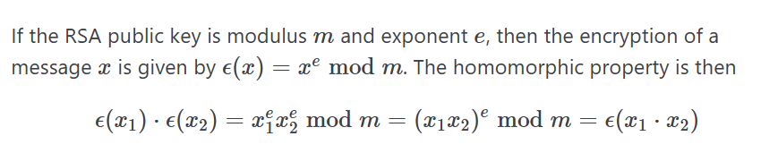
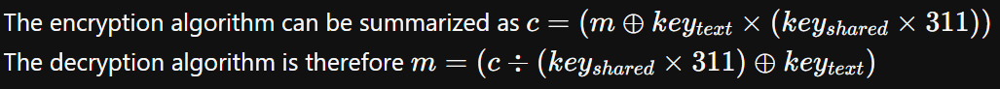

# 1. rsa_oracle

> Can you abuse the oracle?  
> An attacker was able to intercept communications between a bank and a fintech company. They managed to get the [message](resources/cryptography/secret.enc) (ciphertext) and the [password](resources/cryptography/password.enc) that was used to encrypt the message.  
 Additional details will be available after launching your challenge instance.
 After some intensive reconassainance they found out that the bank has an oracle that was used to encrypt the password and can be found here `nc titan.picoctf.net 49920`. Decrypt the password and use it to decrypt the message. The oracle can decrypt anything except the password.

## Solution:

We can decrypt the password using the homomorphic property of RSA, through this [python script](resources/cryptography/rsaoracle/pythonscript.py), which outputs - 

```sh
┌──(soumil㉿Predator)-[~/picoCTF/rsaoracle]
└─$ python3 pythonscript.py
Phase 1: Get password

c = 1634668422544022562287275254811184478161245548888973650857381112077711852144181630709254123963471597994127621183174673720047559236204808750789430675058597

Enter message (m1): a
Have the oracle encrypt this message (m1): a

Enter ciphertext from oracle (c1 = E(m1)): 1894792376935242028465556366618011019548511575881945413668351305441716829547731248120542989065588556431978903597240454296152579184569578379625520200356186


Have the oracle decrypt this message (c2 = c * c1): 3097357265853171086762577146485788014213956517380252195632957286301939282740082358975030469184398860527445348937879783156475536146366758154420391810256611847120173988337373791004871904106220076227501246689936260227532178819705625123684123321350185635500398774070100065478919921540000252731735761585821431042

Enter decrypted ciphertext as HEX (m2 = D(c2): 13c9ad293b45


Password (m = m2 / m1): 4955e

--------------------------------------------------
Phase 2: Decrypt secret.enc

picoCTF{su((3ss_(r@ck1ng_r3@_4955eb5d}
```

when provided the ciphertext of the letter `a` by the oracle, and decrypt the cipher text from the script, `3097357265853171086762577146485788014213956517380252195632957286301939282740082358975030469184398860527445348937879783156475536146366758154420391810256611847120173988337373791004871904106220076227501246689936260227532178819705625123684123321350185635500398774070100065478919921540000252731735761585821431042`.

```sh
┌──(soumil㉿Predator)-[~]
└─$ nc titan.picoctf.net 49920
*****************************************
****************THE ORACLE***************
*****************************************
what should we do for you?
E --> encrypt D --> decrypt.
E
enter text to encrypt (encoded length must be less than keysize): a
a

encoded cleartext as Hex m: 61

ciphertext (m ^ e mod n) 1894792376935242028465556366618011019548511575881945413668351305441716829547731248120542989065588556431978903597240454296152579184569578379625520200356186

what should we do for you?
E --> encrypt D --> decrypt.
D
Enter text to decrypt: 3097357265853171086762577146485788014213956517380252195632957286301939282740082358975030469184398860527445348937879783156475536146366758154420391810256611847120173988337373791004871904106220076227501246689936260227532178819705625123684123321350185635500398774070100065478919921540000252731735761585821431042
decrypted ciphertext as hex (c ^ d mod n): 13c9ad293b45
decrypted ciphertext: É­);E

what should we do for you?
E --> encrypt D --> decrypt.
```

## Flag:

```
picoCTF{su((3ss_(r@ck1ng_r3@_4955eb5d}
```

## Concepts learnt:

- aes-256-cbc encryption
- homomorphic property of RSA

## Notes:

- The homomorphic property of RSA states that -


## Resources:

- [https://blog.cbarkr.com/ctf/picoCTF/practice/rsa_oracle](https://blog.cbarkr.com/ctf/picoCTF/practice/rsa_oracle)
- [https://crypto.stackexchange.com/questions/3555/homomorphic-cryptosystems-in-rsa](https://crypto.stackexchange.com/questions/3555/homomorphic-cryptosystems-in-rsa)


***

# 1. Custom encryption

> Can you get sense of this code file and write the function that will decode the given encrypted file content.
Find the encrypted file here [flag_info](resources/cryptography/customencryption/enc_flag) and [code file](resources/cryptography/customencryption/custom_encryption.py) might be good to analyze and get the flag.

## Solution:

We can use the [python script](resources/cryptography/customencryption/customdecryption.py), made by reverse engineering the code file which gave us
- text_key (used in dynamic_xor_encrypt) is “trudeau”
- shared_key (used in encrypt) can be leaked from test
- The only sources of randomness, a and b in test, are provided in enc_flag
- The encryption algorithm therefore - 


## Flag:

```
picoCTF{custom_d2cr0pt6d_e4530597}
```

## Resources:

- [https://blog.cbarkr.com/ctf/picoCTF/practice/custom-encryption](https://blog.cbarkr.com/ctf/picoCTF/practice/custom-encryption)

***

# 3. miniRSA

> Let's decrypt this: [ciphertext](resources/cryptography/minirsa/ciphertext%20(1))? Something seems a bit small.

## Solution:

Since the `e` is only 3, we can find out the cube root of the number `c = 2205316413931134031074603746928247799030155221252519872650080519263755075355825243327515211479747536697517688468095325517209911688684309894900992899707504087647575997847717180766377832435022794675332132906451858990782325436498952049751141`, which's hexadecimal value can be converted to string to get the flag.

We can use a script like [this](resources/cryptography/minirsa/pythonscript.py) to get the solution which is `0x7069636f4354467b6e3333645f615f6c41726733725f655f64306364366561657d`, which converted to string gives the flag.

## Flag:

```
picoCTF{n33d_a_lArg3r_e_d0cd6eae}
```

## Concepts learnt:

- RSA

## Resources:

- [https://en.wikipedia.org/wiki/RSA_cryptosystem](https://en.wikipedia.org/wiki/RSA_cryptosystem)


***