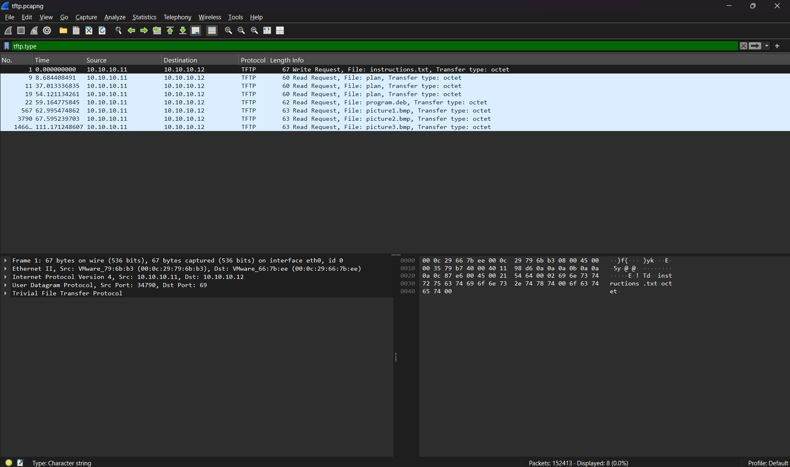
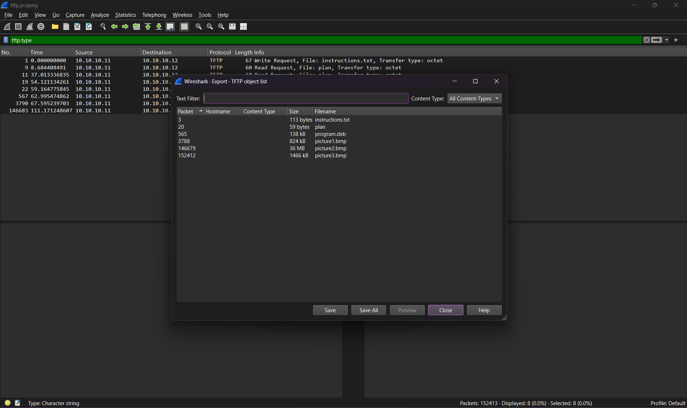
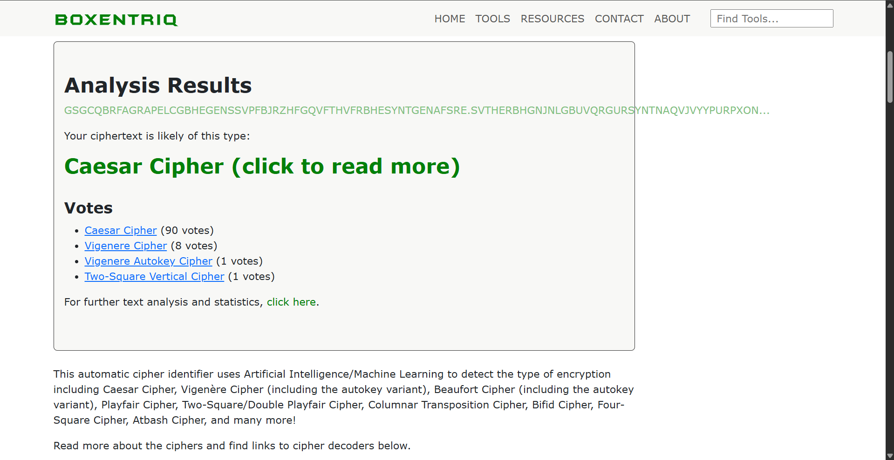
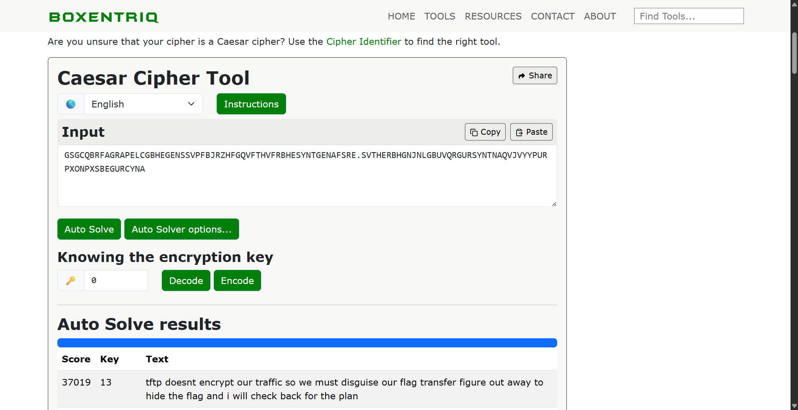
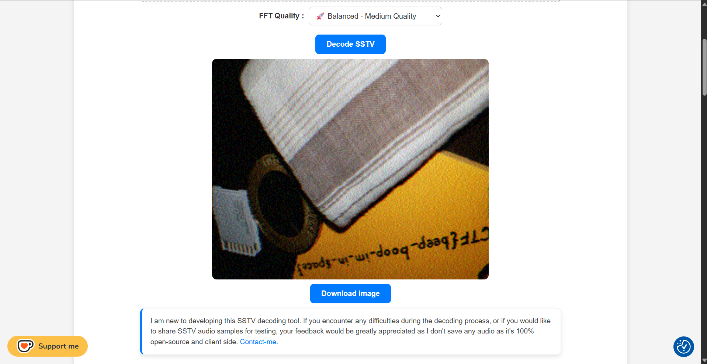

# 1. Trivial Flag Transfer Protocol

> igure out how they moved the [flag](resources/forensics/trivialflagtransferprotocol/tftp.pcapng).

## Solution:

We open the flag using wireshark, and narrow down TFTP traffic using the filter `tftp.type`



We can export this traffic using export objects



Here we can see [instructions.txt](resources/forensics/trivialflagtransferprotocol/instructions.txt), [picture1.bmp](resources/forensics/trivialflagtransferprotocol/picture1.bmp), [picture2.bmp](resources/forensics/trivialflagtransferprotocol/picture2.bmp), [picture3](resources/forensics/trivialflagtransferprotocol/picture3.bmp), [plan](resources/forensics/trivialflagtransferprotocol/plan), [program.deb](resources/forensics/trivialflagtransferprotocol/program.deb)

We can read the instructions,

```sh
┌──(soumil㉿Predator)-[~/picoCTF/trivialflagtransferprotocol]
└─$ cat instructions.txt
GSGCQBRFAGRAPELCGBHEGENSSVPFBJRZHFGQVFTHVFRBHESYNTGENAFSRE.SVTHERBHGNJNLGBUVQRGURSYNTNAQVJVYYPURPXONPXSBEGURCYNA
```

This is likely a cipher and we can decipher it using [https://www.boxentriq.com/](https://www.boxentriq.com/)





instructions.txt contains `"tftp doesnt encrypt our traffic so we must disguise our flag transfer figure out away to hide the flag and i will check back for the plan"`

On reading plan we get,

```sh
┌──(soumil㉿Predator)-[~/picoCTF/trivialflagtransferprotocol]
└─$ cat plan
VHFRQGURCEBTENZNAQUVQVGJVGU-QHRQVYVTRAPR.PURPXBHGGURCUBGBF
```

This is also likely the same cipher which contains `"i used the program and hid it with due diligence check out the photos"`

On installing the program, we get

```sh
┌──(soumil㉿Predator)-[~/picoCTF/trivialflagtransferprotocol]
└─$ sudo apt install ./program.deb
Note, selecting 'steghide' instead of './program.deb'
Installing:
  steghide

Installing dependencies:
  libmcrypt4  libmhash2

Suggested packages:
  libmcrypt-dev  mcrypt

Summary:
  Upgrading: 0, Installing: 3, Removing: 0, Not Upgrading: 0
  Download size: 165 kB / 303 kB
  Space needed: 855 kB / 1,020 GB available

```

Suggesting that the program is steghide and the images are like steganograph

We can use steghide to extract flag from [picture3.bmp](resources/forensics/trivialflagtransferprotocol/picture3.bmp) using the passphrase DUEDILIGENCE as suggested in [plan](resources/forensics/trivialflagtransferprotocol/plan), and we get output

```sh
┌──(soumil㉿Predator)-[~/picoCTF/trivialflagtransferprotocol]
└─$ steghide extract -sf ./picture3.bmp  -p DUEDILIGENCE
wrote extracted data to "flag.txt".
```

Thus we can read [flag.txt](resources/forensics/trivialflagtransferprotocol/flag.txt).

## Flag:

```
picoCTF{h1dd3n_1n_pLa1n_51GHT_18375919}
```

## Concepts learnt:

- In Wireshark, tftp.type is a display filter field used to identify the type of a Trivial File Transfer Protocol packet, such as a Read Request (RRQ), Write Request (WRQ), Data packet, Acknowledgement (ACK), or Error packet. You can use it in the filter bar to narrow down TFTP traffic for analysis. 
- steghide

## Notes:

- hidden in plane sight is almost always steganography
- wireshark filters and traffic viewing

## Resources:

- [https://www.wireshark.org/docs/](https://www.wireshark.org/docs/)

***

# 3. m00nwalk

> Decode this [message](resources/forensics/m00nwalk/message.wav) from the moon.

## Solution:

Searching up the hint on google we can see that 

> How the images were captured
Slow-scan television (SSTV): Because of the limited bandwidth, a special slow-scan television system was used. It transmitted the image in a series of black-and-white frames at 10 frames per second. 
Film photography: NASA also used still cameras for higher-quality photos. These film rolls were developed in space and then the images were scanned and converted into a radio signal to be sent back to Earth. 

Thus we can use a SSTV decoder like [https://sstv-decoder.mathieurenaud.fr/](https://sstv-decoder.mathieurenaud.fr/) to decode the given [file](resources/forensics/m00nwalk/message.wav), we get



## Flag:

```
picoCTF{beep_boop_im_in_space}
```

## Concepts learnt:

- SSTV communication

## Resources:

- [google](https://google.com)


***