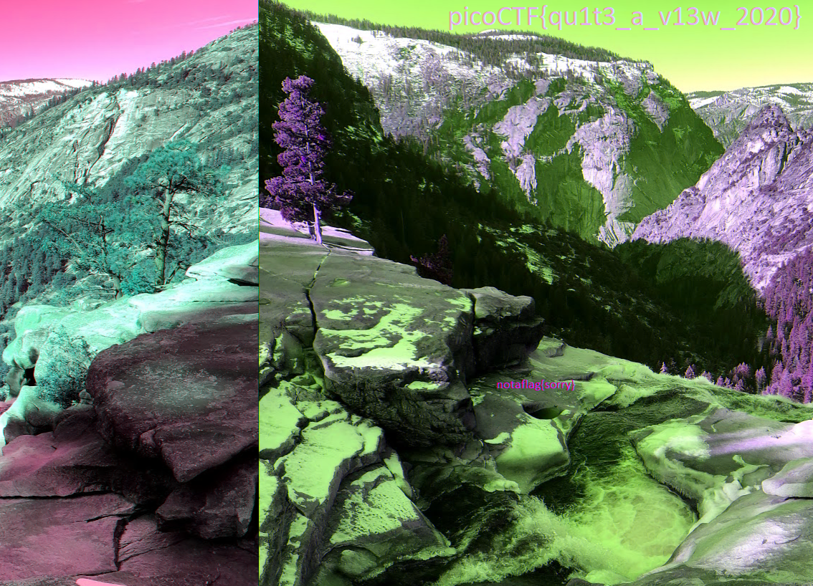

# 1. Trivial Flag Transfer Protocol

> igure out how they moved the [flag](resources/forensics/trivialflagtransferprotocol/tftp.pcapng).

## Solution:

We open the flag using wireshark, and narrow down TFTP traffic using the filter `tftp.type`


We can export this traffic using export objects


Here we can see [instructions.txt](resources/forensics/trivialflagtransferprotocol/instructions.txt), [picture1.bmp](resources/forensics/trivialflagtransferprotocol/picture1.bmp), [picture2.bmp](resources/forensics/trivialflagtransferprotocol/picture2.bmp), [picture3](resources/forensics/trivialflagtransferprotocol/picture3.bmp), [plan](resources/forensics/trivialflagtransferprotocol/plan), [program.deb](resources/forensics/trivialflagtransferprotocol/program.deb)

We can read the instructions,

```sh
┌──(soumil㉿Predator)-[~/picoCTF/trivialflagtransferprotocol]
└─$ cat instructions.txt
GSGCQBRFAGRAPELCGBHEGENSSVPFBJRZHFGQVFTHVFRBHESYNTGENAFSRE.SVTHERBHGNJNLGBUVQRGURSYNTNAQVJVYYPURPXONPXSBEGURCYNA
```

This is likely a cipher and we can decipher it using [https://www.boxentriq.com/](https://www.boxentriq.com/)


instructions.txt contains `"tftp doesnt encrypt our traffic so we must disguise our flag transfer figure out away to hide the flag and i will check back for the plan"`

On reading plan we get,

```sh
┌──(soumil㉿Predator)-[~/picoCTF/trivialflagtransferprotocol]
└─$ cat plan
VHFRQGURCEBTENZNAQUVQVGJVGU-QHRQVYVTRAPR.PURPXBHGGURCUBGBF
```

This is also likely the same cipher which contains `"i used the program and hid it with due diligence check out the photos"`

On installing the program, we get

```sh
┌──(soumil㉿Predator)-[~/picoCTF/trivialflagtransferprotocol]
└─$ sudo apt install ./program.deb
Note, selecting 'steghide' instead of './program.deb'
Installing:
  steghide

Installing dependencies:
  libmcrypt4  libmhash2

Suggested packages:
  libmcrypt-dev  mcrypt

Summary:
  Upgrading: 0, Installing: 3, Removing: 0, Not Upgrading: 0
  Download size: 165 kB / 303 kB
  Space needed: 855 kB / 1,020 GB available

```

Suggesting that the program is steghide and the images are like steganograph

We can use steghide to extract flag from [picture3.bmp](resources/forensics/trivialflagtransferprotocol/picture3.bmp) using the passphrase DUEDILIGENCE as suggested in [plan](resources/forensics/trivialflagtransferprotocol/plan), and we get output

```sh
┌──(soumil㉿Predator)-[~/picoCTF/trivialflagtransferprotocol]
└─$ steghide extract -sf ./picture3.bmp  -p DUEDILIGENCE
wrote extracted data to "flag.txt".
```

Thus we can read [flag.txt](resources/forensics/trivialflagtransferprotocol/flag.txt).

## Flag:

```
picoCTF{h1dd3n_1n_pLa1n_51GHT_18375919}
```

## Concepts learnt:

- In Wireshark, tftp.type is a display filter field used to identify the type of a Trivial File Transfer Protocol packet, such as a Read Request (RRQ), Write Request (WRQ), Data packet, Acknowledgement (ACK), or Error packet. You can use it in the filter bar to narrow down TFTP traffic for analysis. 
- steghide

## Notes:

- hidden in plane sight is almost always steganography
- wireshark filters and traffic viewing

## Resources:

- [https://www.wireshark.org/docs/](https://www.wireshark.org/docs/)

***

# 2. tunn3l v1s10n

> We found this [file](resources/forensics/tunnelvision/tunn3l_v1s10n). Recover the flag.


## Solution:

Using `exiftool` on the file, we can see that its of `BMP` type.

```sh
┌──(soumil㉿Predator)-[~/picoCTF/tunnelvision]
└─$ exiftool tunn3l_v1s10n
ExifTool Version Number         : 13.25
File Name                       : tunn3l_v1s10n
Directory                       : .
File Size                       : 2.9 MB
File Modification Date/Time     : 2025:11:01 13:33:25+05:30
File Access Date/Time           : 2025:11:01 13:33:32+05:30
File Inode Change Date/Time     : 2025:11:01 13:33:32+05:30
File Permissions                : -rw-r--r--
File Type                       : BMP
File Type Extension             : bmp
MIME Type                       : image/bmp
BMP Version                     : Unknown (53434)
Image Width                     : 1134
Image Height                    : 306
Planes                          : 1
Bit Depth                       : 24
Compression                     : None
Image Length                    : 2893400
Pixels Per Meter X              : 5669
Pixels Per Meter Y              : 5669
Num Colors                      : Use BitDepth
Num Important Colors            : All
Red Mask                        : 0x27171a23
Green Mask                      : 0x20291b1e
Blue Mask                       : 0x1e212a1d
Alpha Mask                      : 0x311a1d26
Color Space                     : Unknown (,5%()
Rendering Intent                : Unknown (826103054)
Image Size                      : 1134x306
Megapixels                      : 0.347
```

But since renaming it wont make it display, we need to edit the hex values to correct the headeroffset,

```
00000000   42 4D 8E 26  2C 00 00 00  00 00 BA D0  00 00 28 00  BM.&,.........(.
00000010   00 00 6E 04  00 00 32 01  00 00 01 00  18 00 00 00  ..n...2.........
00000020   00 00 58 26  2C 00 25 16  00 00 25 16  00 00 00 00  ..X&,.%...%.....
00000030   00 00 00 00  00 00 23 1A  17 27 1E 1B  29 20 1D 2A  ......#..'..) .*
00000040   21 1E 26 1D  1A 31 28 25  35 2C 29 33  2A 27 38 2F  !.&..1(%5,)3*'8/
00000050   2C 2F 26 23  33 2A 26 2D  24 20 3B 32  2E 32 29 25  ,/&#3*&-$ ;2.2)%
00000060   30 27 23 33  2A 26 38 2C  28 36 2B 27  39 2D 2B 2F  0'#3*&8,(6+'9-+/
00000070   26 23 1D 12  0E 23 17 11  29 16 0E 55  3D 31 97 76  &#...#..)..U=1.v
00000080   66 8B 66 52  99 6D 56 9E  70 58 9E 6F  54 9C 6F 54  f.fR.mV.pX.oT.oT
00000090   AB 7E 63 BA  8C 6D BD 8A  69 C8 97 71  C1 93 71 C1  .~c..m..i..q..q.
000000A0   97 74 C1 94  73 C0 93 72  C0 8F 6F BD  8E 6E BA 8D  .t..s..r..o..n..
000000B0   6B B7 8D 6A  B0 85 64 A0  74 55 A3 77  5A 98 6F 56  k..j..d.tU.wZ.oV
000000C0   76 52 3A 71  52 3D 6C 4F  40 6D 52 44  6E 53 49 77  vR:qR=lO@mRDnSIw
000000D0   5E 54 53 39  33 70 58 52  76 61 59 73  5F 54 7E 6B  ^TS93pXRvaYs_T~k
000000E0   5E 86 74 63  7E 6A 59 76  62 50 76 5E  4C 7A 62 50  ^.tc~jYvbPv^LzbP
000000F0   87 6D 5D 83  69 59 8D 73  63 9B 81 71  9E 84 74 98  .m].iY.sc..q..t.
00000100   7E 6E 9B 81  71 8D 73 63  73 5A 4A 70  57 47 5A 41  ~n..q.scsZJpWGZA
00000110   31 4F 36 26  4E 37 27 4F  38 28 4F 38  28 51 3A 2A  1O6&N7'O8(O8(Q:*
00000120   50 39 29 4F  38 29 4B 35  29 50 3A 2F  4B 35 2A 3F  P9)O8)K5)P:/K5*?
00000130   29 1E 42 2E  23 4B 37 2C  45 31 26 3F  2B 20 43 2F  ).B.#K7,E1&?+ C/
00000140   24 43 2F 24  40 2A 1F 48  32 27 4B 32  28 47 2E 24  $C/$@*.H2'K2(G.$
00000150   40 27 1D 45  2C 22 4C 34  28 4C 34 28  4B 33 27 4A  @'.E,"L4(L4(K3'J
00000160   32 26 4C 32  24 4E 34 26  50 35 27 52  37 29 53 36  2&L2$N4&P5'R7)S6
00000170   28 55 38 2A  4B 30 22 5D  42 34 63 49  39 49 2F 1F  (U8*K0"]B4cI9I/.
00000180   44 2B 1B 4D  34 24 4D 36  27 4A 33 24  46 2C 20 48  D+.M4$M6'J3$F, H
00000190   2E 22 46 2E  22 44 2E 22  3C 26 1B 32  20 15 30 1F  ."F."D."<&.2 .0.
000001A0   16 32 23 1A  36 27 1E 3C  2B 22 3E 2B  24 42 2C 26  .2#.6'.<+">+$B,&
000001B0   5E 44 3E 66  4C 46 36 1D  19 33 1F 1A  3F 30 2D 13  ^D>fLF6..3..?0-.
000001C0   0A 06 09 06  02 05 04 00  0A 05 04 0B  06 05 0D 05  ................
```

Now on renaming it to `.bmp` we get the decoy flag-


On further editing the hexvalues to get larger width, 

```
00000000   42 4D 8E 26  2C 00 00 00  00 00 BA D0  00 00 28 00  BM.&,.........(.
00000010   00 00 6E 04  00 00 32 03  00 00 01 00  18 00 00 00  ..n...2.........
00000020   00 00 58 26  2C 00 25 16  00 00 25 16  00 00 00 00  ..X&,.%...%.....
00000030   00 00 00 00  00 00 23 1A  17 27 1E 1B  29 20 1D 2A  ......#..'..) .*
00000040   21 1E 26 1D  1A 31 28 25  35 2C 29 33  2A 27 38 2F  !.&..1(%5,)3*'8/
00000050   2C 2F 26 23  33 2A 26 2D  24 20 3B 32  2E 32 29 25  ,/&#3*&-$ ;2.2)%
00000060   30 27 23 33  2A 26 38 2C  28 36 2B 27  39 2D 2B 2F  0'#3*&8,(6+'9-+/
00000070   26 23 1D 12  0E 23 17 11  29 16 0E 55  3D 31 97 76  &#...#..)..U=1.v
00000080   66 8B 66 52  99 6D 56 9E  70 58 9E 6F  54 9C 6F 54  f.fR.mV.pX.oT.oT
00000090   AB 7E 63 BA  8C 6D BD 8A  69 C8 97 71  C1 93 71 C1  .~c..m..i..q..q.
000000A0   97 74 C1 94  73 C0 93 72  C0 8F 6F BD  8E 6E BA 8D  .t..s..r..o..n..
000000B0   6B B7 8D 6A  B0 85 64 A0  74 55 A3 77  5A 98 6F 56  k..j..d.tU.wZ.oV
000000C0   76 52 3A 71  52 3D 6C 4F  40 6D 52 44  6E 53 49 77  vR:qR=lO@mRDnSIw
000000D0   5E 54 53 39  33 70 58 52  76 61 59 73  5F 54 7E 6B  ^TS93pXRvaYs_T~k
000000E0   5E 86 74 63  7E 6A 59 76  62 50 76 5E  4C 7A 62 50  ^.tc~jYvbPv^LzbP
000000F0   87 6D 5D 83  69 59 8D 73  63 9B 81 71  9E 84 74 98  .m].iY.sc..q..t.
00000100   7E 6E 9B 81  71 8D 73 63  73 5A 4A 70  57 47 5A 41  ~n..q.scsZJpWGZA
00000110   31 4F 36 26  4E 37 27 4F  38 28 4F 38  28 51 3A 2A  1O6&N7'O8(O8(Q:*
00000120   50 39 29 4F  38 29 4B 35  29 50 3A 2F  4B 35 2A 3F  P9)O8)K5)P:/K5*?
00000130   29 1E 42 2E  23 4B 37 2C  45 31 26 3F  2B 20 43 2F  ).B.#K7,E1&?+ C/
00000140   24 43 2F 24  40 2A 1F 48  32 27 4B 32  28 47 2E 24  $C/$@*.H2'K2(G.$
00000150   40 27 1D 45  2C 22 4C 34  28 4C 34 28  4B 33 27 4A  @'.E,"L4(L4(K3'J
00000160   32 26 4C 32  24 4E 34 26  50 35 27 52  37 29 53 36  2&L2$N4&P5'R7)S6
00000170   28 55 38 2A  4B 30 22 5D  42 34 63 49  39 49 2F 1F  (U8*K0"]B4cI9I/.
00000180   44 2B 1B 4D  34 24 4D 36  27 4A 33 24  46 2C 20 48  D+.M4$M6'J3$F, H
00000190   2E 22 46 2E  22 44 2E 22  3C 26 1B 32  20 15 30 1F  ."F."D."<&.2 .0.
000001A0   16 32 23 1A  36 27 1E 3C  2B 22 3E 2B  24 42 2C 26  .2#.6'.<+">+$B,&
000001B0   5E 44 3E 66  4C 46 36 1D  19 33 1F 1A  3F 30 2D 13  ^D>fLF6..3..?0-.
000001C0   0A 06 09 06  02 05 04 00  0A 05 04 0B  06 05 0D 05  ................
-**  tunn3l_v1s10n       --0x18/0x2C268E--0%-----------------------------------
```

We get the full image which contains the flag-



## Flag:

```
picoCTF{qu1t3_a_v13w_2020}
```

## Concepts learnt:

- bitmap headers
- exiftool

## Notes:

- Use exiftool for image related ctf's

## Resources:

- [https://gddaredevil.medium.com/tunn3l-v1s10n-picoctf-2021-22af85aab8dc](https://gddaredevil.medium.com/tunn3l-v1s10n-picoctf-2021-22af85aab8dc)

***
# 3. m00nwalk

> Decode this [message](resources/forensics/m00nwalk/message.wav) from the moon.

## Solution:

Searching up the hint on google we can see that 

> How the images were captured
Slow-scan television (SSTV): Because of the limited bandwidth, a special slow-scan television system was used. It transmitted the image in a series of black-and-white frames at 10 frames per second. 
Film photography: NASA also used still cameras for higher-quality photos. These film rolls were developed in space and then the images were scanned and converted into a radio signal to be sent back to Earth. 

Thus we can use a SSTV decoder like [https://sstv-decoder.mathieurenaud.fr/](https://sstv-decoder.mathieurenaud.fr/) to decode the given [file](resources/forensics/m00nwalk/message.wav), we get


## Flag:

```
picoCTF{beep_boop_im_in_space}
```

## Concepts learnt:

- SSTV communication

## Resources:

- [google](https://google.com)


***