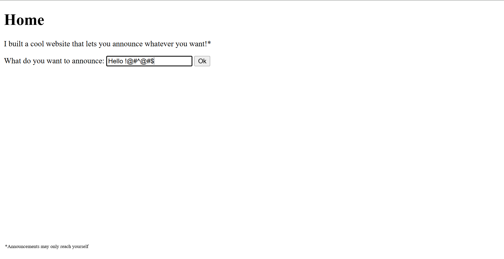
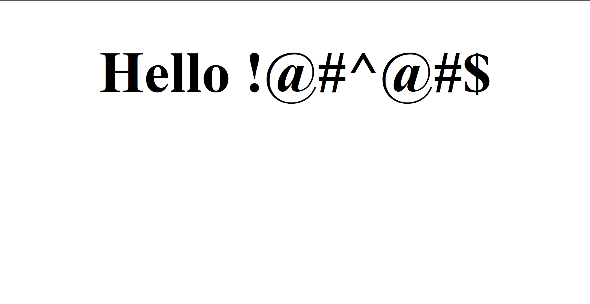
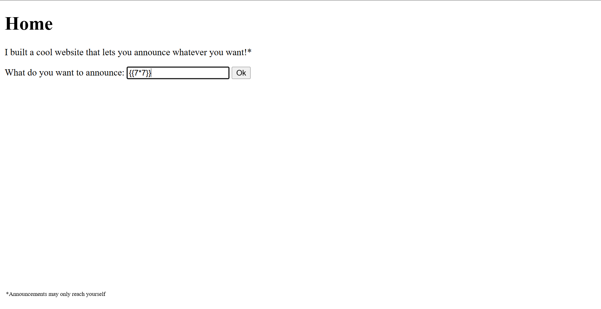
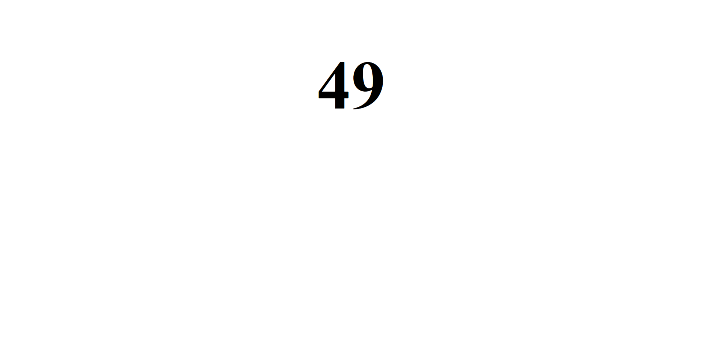
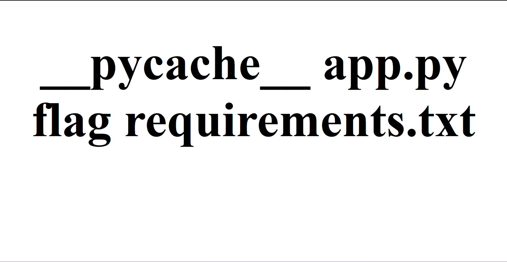
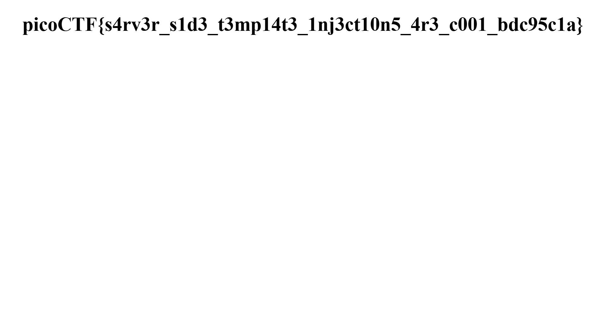
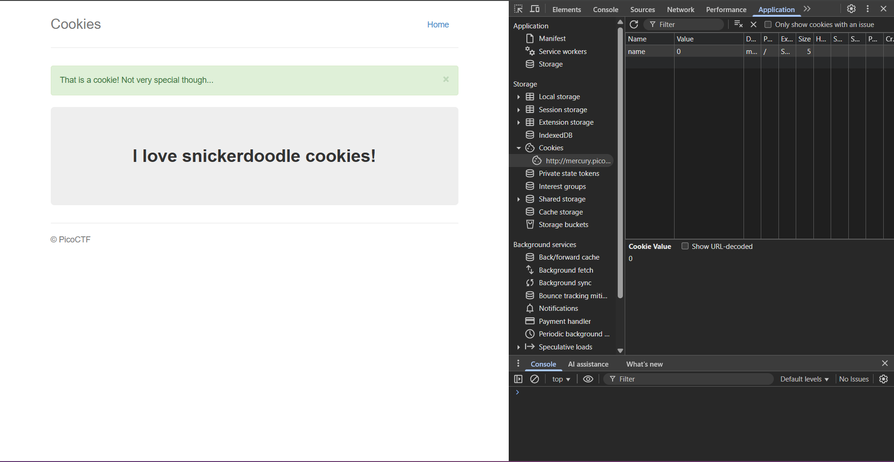
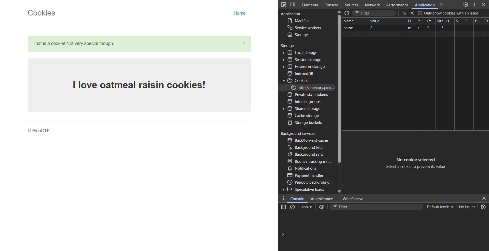
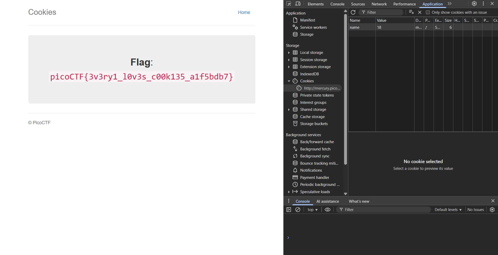

# 1. Web Gauntlet

> Can you beat the filters?
> Log in as admin [http://shape-facility.picoctf.net:64022/](http://shape-facility.picoctf.net:64022/)  
>                 [http://shape-facility.picoctf.net:64022/filter.php](http://shape-facility.picoctf.net:64022/filter.php)

## Solution:

In this challenge, we need to beat the filters and log in as admin, on inputing `admin` as username and password we get - 


And the filter for first round is `Round1: or`.

We can see the sql query in the background, `SELECT * FROM users WHERE username='admin' AND password='admin'`.

And since it uses `AND` we only need either username or password to be correct and can comment out the password check by inputing the username as `admin' --` and the password as any value. 


On the second round the filters are `Round2: or and like = --`, however one of the hints reveals that SQLite is being used as the database, hence we can use other comments which sqlite supports such as `/* */`.

We can enter the username as `admin' /*` and the password as any value again.


On the third round, the filters are `Round3: or and = like > < --`, but we can terminate the query early by using semicolon. This can be done by entering username as `admin';`.


Now the filters for round 4 is `Round4: or and = like > < -- admin`. Since the word `admin` is blocked, we need to use concatenating operator to reconstruct the word admin using the username `adm'||'in';`.


Now the filters for round 5 is `Round5: or and = like > < -- union admin`. Since it doesnt include the concatenation operator we can again use the username `adm'||'in';`.


On checking filter.php we get

```
<?php
session_start();

if (!isset($_SESSION["round"])) {
    $_SESSION["round"] = 1;
}
$round = $_SESSION["round"];
$filter = array("");
$view = ($_SERVER["PHP_SELF"] == "/filter.php");

if ($round === 1) {
    $filter = array("or");
    if ($view) {
        echo "Round1: ".implode(" ", $filter)."<br/>";
    }
} else if ($round === 2) {
    $filter = array("or", "and", "like", "=", "--");
    if ($view) {
        echo "Round2: ".implode(" ", $filter)."<br/>";
    }
} else if ($round === 3) {
    $filter = array(" ", "or", "and", "=", "like", ">", "<", "--");
    // $filter = array("or", "and", "=", "like", "union", "select", "insert", "delete", "if", "else", "true", "false", "admin");
    if ($view) {
        echo "Round3: ".implode(" ", $filter)."<br/>";
    }
} else if ($round === 4) {
    $filter = array(" ", "or", "and", "=", "like", ">", "<", "--", "admin");
    // $filter = array(" ", "/**/", "--", "or", "and", "=", "like", "union", "select", "insert", "delete", "if", "else", "true", "false", "admin");
    if ($view) {
        echo "Round4: ".implode(" ", $filter)."<br/>";
    }
} else if ($round === 5) {
    $filter = array(" ", "or", "and", "=", "like", ">", "<", "--", "union", "admin");
    // $filter = array("0", "unhex", "char", "/*", "*/", "--", "or", "and", "=", "like", "union", "select", "insert", "delete", "if", "else", "true", "false", "admin");
    if ($view) {
        echo "Round5: ".implode(" ", $filter)."<br/>";
    }
} else if ($round >= 6) {
    if ($view) {
        highlight_file("filter.php");
    }
} else {
    $_SESSION["round"] = 1;
}

// picoCTF{y0u_m4d3_1t_79a0ddc6}
?>
```

Thus the flag is `picoCTF{y0u_m4d3_1t_79a0ddc6}`


## Flag:

```
picoCTF{y0u_m4d3_1t_79a0ddc6}
```

## Concepts learnt:

- `--` is a common SQL comment.
- SQLite also uses `/* */` as comments.
- We can terminate statements early in SQLite using `;`.
- SQLite has concatenating operator `||`.

## Notes:

- Tried setting value of cookies as admin but that didnt work.

## Resources:

- [https://medium.com/@sobatistacyber/picoctf-writeup-web-gauntlet-7c3b8c7c7946](https://medium.com/@sobatistacyber/picoctf-writeup-web-gauntlet-7c3b8c7c7946).

***

# 2. SSTI1

> I made a cool website where you can announce whatever you want! Try it out!
  I heard templating is a cool and modular way to build web apps! Check out my website [here](http://rescued-float.picoctf.net:63742/)!

## Solution:

On loading up the challenge, we can see the home page, which will announce whatever we type into the text box.




We can try sending a payload like `{{7*7}}` to see if the input is being sanitized,




This shows that the server is vulnerable to SSTI vulnerability.

Next we can try sending a payload like `{{ self._TemplateReference__context.cycler.__init__.__globals__.os.popen('ls').read() }}` which lists the contents in directory.



Now we can `cat flag` using the payload `{{ self._TemplateReference__context.cycler.__init__.__globals__.os.popen('cat flag').read() }}`.




## Flag:

```
picoCTF{s4rv3r_s1d3_t3mp14t3_1nj3ct10n5_4r3_c001_bdc95c1a}
```

## Concepts learnt:

- Server Side Template Injection (SSTI)
- Detecting SSTI through fuzzing.
- Sanitizing Input
- RCE
- Jinja2 exploitation

## Notes:

- Server-side template injection is when an attacker is able to use native template syntax to inject a malicious payload into a template, which is then executed server-side.
- Fuzzing to detect Server-Side Template Injection (SSTI) involves systematically injecting template syntax and special characters into all user-controllable input fields. You then analyze the application's responses for unusual behavior, such as error messages, execution of mathematical expressions, or time delays, to confirm and identify the template engine.
- RCE stands for Remote Code Execution, a severe cybersecurity vulnerability that allows an attacker to remotely execute malicious code on a target system. This gives the attacker unauthorized control over the compromised machine, enabling them to steal data, deploy malware, disrupt services, or use the system for other attacks.
- Jinja2, the default template engine in Flask, is extremely powerful as it permits the execution of pure Python code.  Python's os.popen function achieves RCE because it leverages system-level calls to bypass input filters. Hence we can use a template like `{{ self._TemplateReference__context.cycler.__init__.__globals__.os.popen('cat flag').read() }}` which allows us to pass terminal code as payload to achieve RCE.

## Resources:

- [https://www.yeswehack.com/learn-bug-bounty/server-side-template-injection-exploitation](https://www.yeswehack.com/learn-bug-bounty/server-side-template-injection-exploitation)

***

# 3. Cookies

> Who doesn't love cookies? Try to figure out the best one. [http://mercury.picoctf.net:29649/](http://mercury.picoctf.net:29649/)

## Solution:

When entering the placeholder name we get 



Here we see the cookie `name`'s value change from `-1` to `0`. On inputing value as `1` and reloading, we get


Similarly on value `2` we get



By using trial and error, on value `18` we get



Thus 

## Flag:

```
picoCTF{3v3ry1_l0v3s_c00k135_a1f5bdb7}
```

## Concepts learnt:

- Cookies

## Notes:

- Cookies are small files that websites store on your computer to remember information about you and your browsing activity. They hold a name and a value.

***